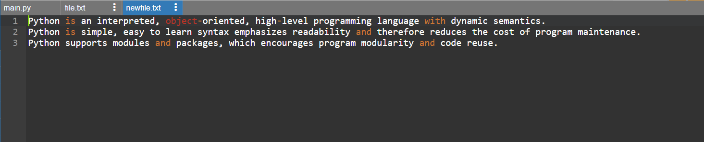

# COPY-FILE:
## AIM:
To write a python program for copying the contents from one file to another file.
## EQUIPEMENT'S REQUIRED: 
PC
Anaconda - Python 3.7
## ALGORITHM: 
### Step 1:
Use open function to open the file in which we want to copy from and access it in read mode.
### Step 2: 
 Read the file and store in a variable.
### Step 3: 
Now create a new file in which we want to paste the content using write access mode.
### Step 4:  
Use write function to copy the read file that has been stored in the variable.
### Step 5: 
The content in the original file will be copied in the new file.
### Step 6: 
End the program.
## PROGRAM:
```
Program to mark the maximum of marks using the list method sort
Developed by: Vaishnavi M
RegisterNumber: 21500310

with open ("file.txt") as fp :
    with open ("newfile.txt","w") as fp1:
        line=fp.read()
        fp1.write(line)
```

### OUTPUT:



## RESULT:
Thus the program is written to copy the contents from one file to another file.